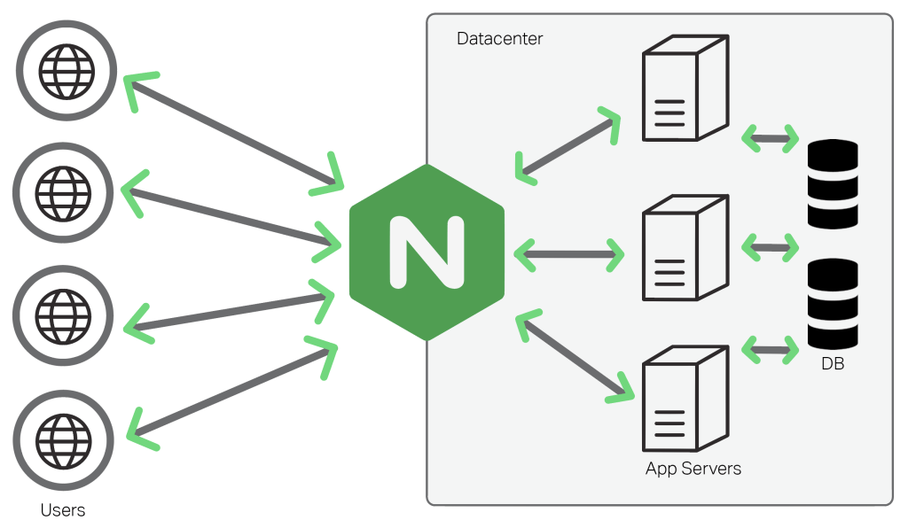

# 프록시 패턴

## 프록시 패턴

* 대상 객체에 접근하기 전 그 접근에 대한 흐름을 가로채 대상 객체 앞단의 인터페이스 역할을 하는 디자인 패턴
* 객체의 속성, 변환 등을 보안하며 보안, 데이터 검증, 캐싱, 로깅에 사용한다

## 프록시 서버

* 서버와 클라이언트 사이에서 클라이언트가 자신을 통해 다른 네트워크 서비스에 간접적으로 접속할 수 있게 해주 컴퓨터 시스템이나 응용프로그램
* ex) nginx : 비동기 이벤트 기반의 구조와 다수의 연결을 효과적으로 처리 가능한 웹서버 주로 Node.js 앞단의 프록시 서버로 활용된다.&#x20;
* 프록시 서버에서의 캐싱 ex) web 서버에서 시각화에 필요한 데이터를 캐싱 하고 있어. DB를 I/O 줄일 수 있다.

* nginx를 프록시 서버로 둬서 실제 포트를 숨길 수 있고, 정적 자원을 gzip 압축하거나 메인 서버 앞단에서의 로깅을 할 수 도 있다

### Cloud Flare

* Cloud Flare는 전세계적으로 분산된 서가 있고 이를 통해 어떠한 시스템의콘텐츠 전달을 빠르게 할 수 있는 CDN 서비스
  * CDN(Content Delivery Network) : 각 사용자가 인ㅓ넷에 접속하는 곳과 가운곳에서 콘테느를 캐싱/배포 하는 서버 네트워크. 웹 서버로부터 콘텐츠 다로드 시간을 줄일 수 있다 &#x20;
* DDOS 공격 방어: 거대한 네트워크 용량과 캐싱 전략으로 소규모 DDOS 공격은 쉽게 막고, 방화벽 대시보드 제공
* 손쉬운 HTTPS 구축

### CORS

pass
